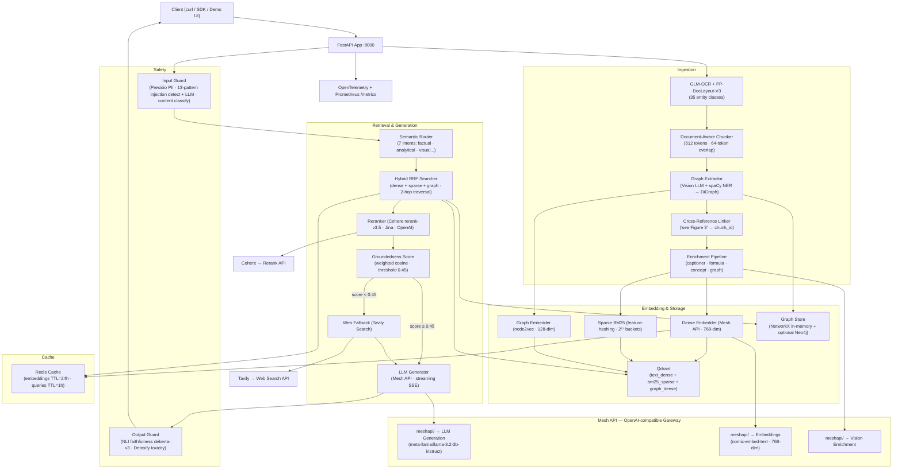

<div align="center">

# doc-intel-rag

### Intelligence Beyond Retrieval

**A production-grade, knowledge-graph-augmented multimodal RAG system**  
that ingests rich documents, extracts entity relationships, routes queries by intent,  
streams cited answers, and falls back to live web search — with enterprise safety built in.

---


</div>

---

## Live Deployment

| Endpoint | URL | Status |
|---|---|---|
| **API + Swagger UI** | [/docs](http://doc-intel-rag-alb-1457953429.us-east-1.elb.amazonaws.com/docs) |  |
| **Health check** | [/health](http://doc-intel-rag-alb-1457953429.us-east-1.elb.amazonaws.com/health) |  |
| **Prometheus metrics** | [/metrics](http://doc-intel-rag-alb-1457953429.us-east-1.elb.amazonaws.com/metrics) |  |

**Base URL:** `http://doc-intel-rag-alb-1457953429.us-east-1.elb.amazonaws.com`

Hosted on **AWS ECS Fargate** (us-east-1) behind an Application Load Balancer.  
Infrastructure provisioned and managed by **Terraform** (state in S3 + DynamoDB lock).

---

## What Makes This Different

| Capability | Standard RAG | doc-intel-rag | Stack |
|---|:---:|:---:|---|
| Text extraction | ✓ | ✓ | PyMuPDF, python-docx, python-pptx |
| Layout-aware parsing (tables, formulas, figures) | Partial | ✓ | 35 entity types via PP-DocLayout-V3 |
| OCR for scanned pages | ✗ | ✓ | moondream vision model (Ollama) |
| Image / chart captioning | ✗ | ✓ | moondream via OpenAI-compatible API |
| Knowledge graph from diagrams + text | ✗ | ✓ | NetworkX DiGraph + optional Neo4j |
| Cross-reference linking ("see Figure 3" → chunk) | ✗ | ✓ | cross_ref_linker.py |
| Query intent routing (7 classes) | ✗ | ✓ | llama3.2:1b via Ollama |
| Three-vector hybrid search | ✗ | ✓ | Qdrant: dense + BM25 sparse + graph |
| Groundedness scoring + web fallback | ✗ | ✓ | Tavily Search API |
| Cross-encoder reranking | ✗ | ✓ | Cohere Rerank 3.5 |
| Streaming SSE generation | ✗ | ✓ | FastAPI + Server-Sent Events |
| Redis embedding + query cache | ✗ | ✓ | TTL: embeddings 24h, queries 1h |
| PII detection + redaction | ✗ | ✓ | Microsoft Presidio |
| Prompt injection detection | ✗ | ✓ | 13 regex patterns + LLM classifier |
| NLI faithfulness scoring | ✗ | ✓ | deberta-v3-base cross-encoder |
| Toxicity filtering | ✗ | ✓ | Detoxify |
| OpenTelemetry traces + Prometheus metrics | ✗ | ✓ | Jaeger + /metrics endpoint |
| API-key auth + rate limiting | ✗ | ✓ | X-API-Key header + slowapi |
| Terraform IaC | ✗ | ✓ | 7 modules, S3 state, auto-scaling |

---

## Architecture



---

## Project Structure

```
doc-intel-rag/
├── src/doc_intel_rag/
│   ├── config.py                    # Pydantic-settings v2 — single source of truth
│   ├── logging_config.py            # Loguru + stdlib interception + OTel
│   ├── exceptions.py                # Full domain exception hierarchy (15 classes)
│   │
│   ├── parsing/                     # Document ingestion layer
│   │   ├── pipeline.py              # DocumentParser: PDF/DOCX/PPTX/HTML/Markdown + OCR
│   │   ├── entity_types.py          # 35 EntityLabel enum + modality mapping
│   │   ├── post_processor.py        # ParseResult → structured Markdown
│   │   ├── graph_extractor.py       # Vision LLM → NetworkX DiGraph + spaCy NER
│   │   └── cross_ref_linker.py      # "see Figure 3" → chunk_id resolution
│   │
│   ├── chunking/
│   │   ├── schemas.py               # Chunk dataclass, ChunkModality enum, BBox
│   │   ├── document_chunker.py      # Atomic + text accumulation strategy, breadcrumbs
│   │   └── semantic_merger.py       # Merge tiny adjacent chunks (cosine > 0.85)
│   │
│   ├── enrichment/
│   │   ├── captioner.py             # Per-modality LLM vision captions (client cached)
│   │   ├── formula_enricher.py      # pylatexenc validation + verbal LLM description
│   │   ├── concept_extractor.py     # spaCy NER → concept_tags per chunk
│   │   └── graph_enricher.py        # Edge list + centrality + LLM summary
│   │
│   ├── ingestion/
│   │   ├── embedder.py              # Dense 768-dim + sparse BM25 (2^17) + Redis cache
│   │   ├── vector_store.py          # QdrantDocumentStore: 3 vectors, RRF fusion
│   │   ├── graph_embedder.py        # node2vec → 128-dim graph_dense vector
│   │   ├── graph_store.py           # In-memory NetworkX GraphStore + Neo4j export
│   │   └── cache.py                 # EmbeddingCache + QueryCache (Redis async)
│   │
│   ├── retrieval/
│   │   ├── semantic_router.py       # LLM → 7 QueryIntent classes (client cached)
│   │   ├── hybrid_searcher.py       # Prefetch + RRF fusion + 2-hop graph traversal
│   │   ├── reranker.py              # Cohere / Jina / OpenAI cross-encoder (immutable)
│   │   ├── groundedness.py          # Weighted chunk-score groundedness metric
│   │   └── web_fallback.py          # Tavily search → ScoredChunk list
│   │
│   ├── generation/
│   │   ├── generator.py             # Streaming SSE generation (LLM client cached)
│   │   ├── context_builder.py       # Multimodal message assembly
│   │   ├── prompt_templates.py      # Jinja2 system + user templates
│   │   └── citation_formatter.py    # [Source N] inline markers + bibliography
│   │
│   ├── safety/
│   │   ├── schemas.py               # SafetyResult, OutputGuardResult, GuardrailViolation
│   │   ├── input_guard.py           # PII → injection → content classification
│   │   ├── output_guard.py          # NLI faithfulness + Detoxify toxicity
│   │   ├── phi_detector.py          # Presidio PII detect-and-redact
│   │   └── rate_limiter.py          # slowapi per-IP rate limiting
│   │
│   ├── api/
│   │   ├── app.py                   # FastAPI factory + lifespan + exception handlers
│   │   ├── middleware.py            # RequestIDMiddleware + security headers
│   │   ├── dependencies.py          # Singleton DI (embedder, vector_store, reranker…)
│   │   ├── schemas.py               # All Pydantic v2 request/response models
│   │   └── routes/
│   │       ├── health.py            # GET /health
│   │       ├── ingest.py            # POST /v1/ingest, /v1/ingest/file
│   │       ├── search.py            # POST /v1/search
│   │       ├── generate.py          # POST /v1/generate (SSE or JSON)
│   │       ├── graph.py             # GET /v1/graph/{doc_id}
│   │       └── admin.py             # GET /v1/admin/stats, POST /v1/admin/purge-cache
│   │
│   └── utils/
│       ├── token_utils.py           # tiktoken cl100k_base helpers
│       ├── image_utils.py           # Base64 image encode/decode helpers
│       ├── pdf_utils.py             # PyMuPDF page crop helpers
│       └── async_utils.py           # Async utilities
│
├── tests/
│   ├── conftest.py                  # Sets DOC_INTEL_SKIP_VALIDATION=1 for all tests
│   ├── unit/
│   │   ├── test_chunker.py          # 7 tests — chunking logic
│   │   ├── test_groundedness.py     # 5 tests — score formula
│   │   ├── test_graph_extractor.py  # 5 tests — graph extraction + spaCy NER
│   │   └── test_safety_input.py     # 9 tests — PII, injection, content classification
│   └── integration/
│       ├── test_ingest_pipeline.py  # Mocked document parse + chunk + embed
│       ├── test_search_endpoint.py  # FastAPI TestClient, mocked dependencies
│       └── test_generate_endpoint.py# FastAPI TestClient, SSE + non-streaming
│
├── scripts/
│   ├── parse.py                     # CLI: parse document → Markdown + JSON
│   ├── ingest.py                    # CLI: ingest document into Qdrant
│   ├── search.py                    # CLI: interactive search REPL
│   ├── serve.py                     # CLI: start API server
│   ├── warmup.py                    # CLI: pre-load models before first ingest
│   └── inject_github_secrets.py     # Encrypt + push .env → GitHub Actions Secrets
│
├── docker/
│   ├── Dockerfile                   # CPU multi-stage build (builder + runtime)
│   ├── Dockerfile.gpu               # CUDA 12.4 variant
│   └── docker-compose.yml           # app + qdrant + redis + neo4j + visualiser + jaeger
│
├── deploy/
│   ├── aws/
│   │   ├── deploy.sh                # ECS Fargate deployment script
│   │   └── task-definition.json     # ECS task definition
│   ├── ARCHITECTURE.md              # 12-section enterprise architecture diagrams
│   └── DEPLOYMENT.md                # Step-by-step deployment guide
│
├── notebooks/
│   └── explore_pipeline.ipynb       # End-to-end demo: parse → chunk → embed → search
│
├── data/                            # Sample documents for testing
├── .env.example                     # Complete environment variable reference
├── .github/workflows/
│   └── deploy-ecs.yml               # CI/CD: test → build → push ECR → deploy ECS
├── CLAUDE.md                        # Claude Code project guide
└── pyproject.toml                   # uv project config + all ~50 dependencies
```

---

## Quick Start

### 1. Prerequisites

- Python 3.12+
- [uv](https://docs.astral.sh/uv/) package manager
- Docker + Docker Compose

### 2. Clone and Install

```bash
git clone https://github.com/jndumu/Enhanced-Multimodel-Rag-Hackerton.git
cd Enhanced-Multimodel-Rag-Hackerton
uv sync
```

### 3. Configure

```bash
cp .env.example .env
# Edit .env — minimum required:
```

```env
MESH_API_KEY=your-mesh-key

# Reranker — pick one:
COHERE_API_KEY=your-cohere-key       # default backend
# JINA_API_KEY=your-jina-key
# OPENAI_API_KEY=your-openai-key

# Optional but recommended:
GLMOCR_API_KEY=your-glmocr-key      # cloud document parsing
TAVILY_API_KEY=your-tavily-key       # web fallback
```

### 4. Start Services

```bash
# Full stack: app + qdrant + redis + neo4j + visualiser + jaeger
docker compose -f docker/docker-compose.yml up -d
```

| Service | URL | Purpose |
|---|---|---|
| API + Swagger | `http://localhost:8000/docs` | REST API + interactive docs |
| Qdrant UI | `http://localhost:6333/dashboard` | Vector database dashboard |
| Graph visualiser | `http://localhost:8501` | Streamlit knowledge graph explorer |
| Jaeger traces | `http://localhost:16686` | Distributed trace viewer |
| Prometheus | `http://localhost:8000/metrics` | Metrics endpoint |
| Neo4j browser | `http://localhost:7474` | Graph database explorer |

Or run locally without Docker:

```bash
# Start Qdrant and Redis separately, then:
uv run python scripts/serve.py --port 8000 --reload
```

### 5. Ingest a Document

```bash
# File upload (PDF, DOCX, PPTX, HTML, Markdown)
curl -X POST http://localhost:8000/v1/ingest/file \
  -H "X-API-Key: your-key" \
  -F "file=@document.pdf" \
  -F "enrich=true"

# By file path
curl -X POST http://localhost:8000/v1/ingest \
  -H "X-API-Key: your-key" \
  -H "Content-Type: application/json" \
  -d '{"source": "/absolute/path/document.pdf", "enrich": true}'

# CLI
uv run python scripts/ingest.py document.pdf
```

Response:

```json
{
  "doc_id": "sha256:a1b2c3d4...",
  "chunk_count": 187,
  "graph_node_count": 43,
  "collection": "doc_intel",
  "cached": false
}
```

### 6. Search and Generate

```bash
# Hybrid retrieval with semantic routing and reranking
curl -X POST http://localhost:8000/v1/search \
  -H "X-API-Key: your-key" \
  -H "Content-Type: application/json" \
  -d '{"query": "How does the attention mechanism relate to performance?", "top_k": 20, "top_n": 5}'

# Streaming answer generation (SSE)
curl -N -X POST http://localhost:8000/v1/generate \
  -H "X-API-Key: your-key" \
  -H "Content-Type: application/json" \
  -d '{"query": "Summarise the key findings.", "streaming": true, "max_tokens": 1024}'

# Non-streaming answer
curl -X POST http://localhost:8000/v1/generate \
  -H "X-API-Key: your-key" \
  -H "Content-Type: application/json" \
  -d '{"query": "What is the main conclusion?", "streaming": false}'
```

---

## Entity Types — 35 Classes

`doc-intel-rag` identifies every structural region on a page:

| Group | Entity Labels |
|---|---|
| **Structural** | `document_title` `section_title` `subsection_title` `paragraph` `abstract` `list_item` `blockquote` `footnote` `header` `footer` `page_number` |
| **Mathematical** | `formula` `formula_block` `inline_formula` `chemical_formula` `equation_number` |
| **Tabular** | `table` `table_caption` `table_footnote` |
| **Visual** | `figure` `image` `figure_caption` `chart` `flowchart` `diagram` `relationship_graph` |
| **Medical** | `medical_scan` `histology` `clinical_photo` |
| **Code** | `algorithm` `pseudo_code` `code_block` |
| **References** | `citation` `reference_list` `seal` |

Atomic elements (tables, formulas, images, graphs, algorithms, code) are **never split** across chunk boundaries.

---

## Semantic Query Router

Every query is classified into one of 7 intents before retrieval. The router automatically adjusts the search strategy:

| Intent | Trigger Example | Retrieval Adjustment |
|---|---|---|
| `factual` | "What is the half-life of X?" | Boosts BM25 sparse weight |
| `analytical` | "Compare the two experimental approaches" | Doubles top_k, enables graph traversal |
| `visual` | "Show me the system architecture diagram" | Filters to `image · chart · diagram` |
| `mathematical` | "What does the loss function measure?" | Filters to `formula` modality |
| `code` | "Explain Algorithm 2" | Filters to `algorithm · code` |
| `relational` | "How does component A relate to B?" | Enables 2-hop graph traversal |
| `general` | Everything else | Default hybrid search |

---

## Knowledge Graph

`doc-intel-rag` builds a **per-document knowledge graph** from two sources simultaneously:

**Visual extraction**: Flowcharts, diagrams, and relationship graphs are sent to Mesh API vision, which returns structured JSON with nodes and edges. Converted to a `NetworkX DiGraph`.

**Text extraction**: spaCy NER runs on every text chunk to extract named entity pairs and their semantic relations, merged into the same graph.

**Graph retrieval**: For `relational` and `analytical` queries, the searcher seeds from the top vector results and traverses **2 hops** through the graph, surfacing connected entities that pure vector similarity would miss.

**Cross-reference linking**: Text references like *"see Figure 3"* or *"Table 2 shows"* are resolved to their target chunk IDs and stored as bidirectional `cross_refs` — visible via the `/v1/graph/{doc_id}` endpoint.

**Neo4j export**: Set `NEO4J_URI` to export the full graph for exploration in the Neo4j browser.

```bash
# Retrieve knowledge graph for a document
curl -X GET http://localhost:8000/v1/graph/sha256:a1b2c3d4 \
  -H "X-API-Key: your-key"
```

```json
{
  "doc_id": "sha256:a1b2c3d4",
  "nodes": [
    {"id": "n1", "label": "Transformer", "type": "concept", "degree_centrality": 0.82},
    {"id": "n2", "label": "Attention Mechanism", "type": "concept", "degree_centrality": 0.74}
  ],
  "edges": [
    {"source": "n1", "target": "n2", "relation": "uses", "chunk_id": "abc123", "page": 4}
  ],
  "total_nodes": 43,
  "total_edges": 61
}
```

---

## Groundedness & Web Fallback

After reranking, before generation, a groundedness score measures how well the retrieved context supports an answer.

If `groundedness_score < GROUNDEDNESS_THRESHOLD` (default `0.45`) and `FALLBACK_ENABLED=true`:

1. **Tavily Search API** is called automatically with the original query.
2. Up to `TAVILY_MAX_RESULTS` web results are converted to chunks tagged `retrieval_source="web"`.
3. Web chunks are merged with document chunks and passed to the LLM.
4. The LLM cites web sources as `[Web Source N]` — distinct from document `[Source N]` citations.
5. Every response includes `"fallback_used": true/false` so callers always know provenance.

The system **never fabricates** an answer when documents are insufficient — it supplements transparently from the web or says it cannot answer.

---

## Streaming Generation (SSE)

`POST /v1/generate` with `"streaming": true` delivers real-time Server-Sent Events:

```
data: {"delta": "The main theorem states", "done": false}

data: {"delta": " that for all n > 2, no integer solution exists...", "done": false}

data: {
  "done": true,
  "sources": [
    {"chunk_id": "abc123", "page": 7, "source_file": "paper.pdf", "modality": "text"}
  ],
  "groundedness_score": 0.82,
  "faithfulness_score": 0.91,
  "fallback_used": false,
  "web_sources": []
}
```

Set `"streaming": false` for a single JSON response instead.

---

## API Reference

### Authentication

Pass `X-API-Key: <your-key>` on all protected endpoints. Leave `API_KEYS=[]` in `.env` to disable auth (development only).

### Endpoints

| Method | Path | Auth | Description |
|---|---|---|---|
| `GET` | `/health` | Optional | Component liveness: Qdrant · Redis · Mesh API |
| `GET` | `/metrics` | — | Prometheus metrics |
| `POST` | `/v1/ingest` | key | Ingest by URL or file path |
| `POST` | `/v1/ingest/file` | key | Upload file (multipart) |
| `DELETE` | `/v1/collections/{name}` | key | Delete Qdrant collection + flush Redis |
| `GET` | `/v1/graph/{doc_id}` | key | Export knowledge graph (nodes + edges JSON) |
| `POST` | `/v1/search` | key | Retrieve + rerank, no generation |
| `POST` | `/v1/generate` | key | Full RAG pipeline — SSE stream or JSON |
| `GET` | `/v1/admin/stats` | key | Collection stats, cache hit rate, uptime |
| `POST` | `/v1/admin/purge-cache` | key | Flush Redis query cache |

### `POST /v1/search` — Request

```json
{
  "query": "What were the primary efficacy endpoints?",
  "collection": "doc_intel",
  "top_k": 20,
  "top_n": 5,
  "modality_filter": ["text", "table"],
  "filters": {"source_file": "trial_report.pdf"}
}
```

### `POST /v1/search` — Response

```json
{
  "query": "What were the primary efficacy endpoints?",
  "chunks": [
    {
      "chunk_id": "abc123",
      "text": "The primary endpoint was HbA1c reduction at week 24...",
      "source_file": "trial_report.pdf",
      "page": 12,
      "modality": "table",
      "score": 0.92,
      "retrieval_source": "qdrant",
      "section_path": ["Results", "3.1 Primary Endpoints"],
      "concept_tags": ["HbA1c", "efficacy", "clinical trial"]
    }
  ],
  "groundedness_score": 0.87,
  "fallback_used": false,
  "web_sources": [],
  "safety": {
    "pii_redacted": false,
    "redacted_entities": [],
    "injection_detected": false,
    "content_class": "benign"
  },
  "request_id": "uuid4-here",
  "latency_ms": 734.2
}
```

### `POST /v1/generate` — Request

```json
{
  "query": "Summarise the mechanism of action with citations.",
  "top_k": 20,
  "top_n": 5,
  "streaming": true,
  "max_tokens": 1024,
  "temperature": 0.2,
  "include_sources": true,
  "fallback_enabled": true
}
```

### `GET /health` — Response

```json
{
  "status": "ok",
  "components": {
    "qdrant":   {"status": "ok", "latency_ms": 45.2},
    "redis":    {"status": "ok", "latency_ms": 1.1},
    "mesh_api": {"status": "ok", "latency_ms": 210.0}
  },
  "version": "0.1.0"
}
```

---

## Safety Architecture

### Input Guard (pre-retrieval)

Every query passes three stages before touching any data:

**Stage 1 — PII Detection (Microsoft Presidio)**

```
Detects: PERSON · EMAIL_ADDRESS · PHONE_NUMBER · IP_ADDRESS
         CREDIT_CARD · IBAN_CODE · LOCATION · DATE_TIME · URL · NRP

SAFETY_BLOCK_ON_PII=false (default) → redact with <PERSON>, <EMAIL>, etc. and continue
SAFETY_BLOCK_ON_PII=true            → HTTP 400 immediately
```

**Stage 2 — Prompt Injection Detection**

```
13 rule-based patterns: "ignore previous", "you are now", "act as", "jailbreak", etc.
+ LLM classifier: "Does this text attempt to override system instructions?"
If detected → HTTP 400
```

**Stage 3 — Content Classification**

```
LLM: classify into benign | sensitive | off_topic | harmful
harmful   → HTTP 400
off_topic → proceed with warning in response metadata
```

### Output Guard (post-generation)

**Faithfulness — NLI cross-encoder**
```
Model: cross-encoder/nli-deberta-v3-base (sentence-transformers)
Scores entailment(context_text, generated_answer)
Score < 0.5 → appends warning banner to answer
```

**Toxicity — Detoxify**
```
Dimensions checked: toxic · severe_toxic · obscene · threat · insult · identity_hate
Any score > 0.7 → replaces answer with a safe refusal message
```

---

## Configuration Reference

### LLM + Embeddings (OpenAI-compatible)

| Variable | Default | Description |
|---|---|---|
| `MESH_API_KEY` | — | **Required.** API key for the LLM + embeddings provider |
| `MESH_API_BASE_URL` | `https://api.mesh.ai/v1` | OpenAI-compatible endpoint (swap for Ollama, Azure, etc.) |
| `MESH_LLM_MODEL` | `mesh-gpt-4o` | Generation model |
| `MESH_EMBEDDING_MODEL` | `mesh-text-embedding-3-large` | Embedding model |
| `MESH_EMBEDDING_DIM` | `3072` | Vector dimensions — immutable after first ingest |

### Document Parsing

| Variable | Default | Description |
|---|---|---|
| `GLMOCR_API_KEY` | — | GLM-OCR cloud API key |
| `GLMOCR_BACKEND` | `cloud` | `cloud` or `local` |
| `GLMOCR_TIMEOUT` | `120` | Parse timeout in seconds |

### Vector Store & Graph

| Variable | Default | Description |
|---|---|---|
| `QDRANT_URL` | `http://localhost:6333` | Qdrant URL |
| `QDRANT_API_KEY` | — | Qdrant API key (authenticated clusters) |
| `QDRANT_COLLECTION` | `doc_intel` | Default collection name |
| `NEO4J_URI` | — | Optional. Enables Neo4j graph export |

### Reranker

| Variable | Default | Description |
|---|---|---|
| `RERANKER_BACKEND` | `cohere` | `cohere` · `jina` · `openai` |
| `COHERE_API_KEY` | — | Required when backend=cohere |
| `COHERE_RERANK_MODEL` | `rerank-v3.5` | Cohere model |
| `JINA_API_KEY` | — | Required when backend=jina |
| `OPENAI_API_KEY` | — | Required when backend=openai |

### Redis Cache

| Variable | Default | Description |
|---|---|---|
| `REDIS_URL` | `redis://localhost:6379` | Redis connection URL |
| `REDIS_EMBEDDING_TTL` | `86400` | Embedding cache TTL — 1 day |
| `REDIS_QUERY_TTL` | `3600` | Query result cache TTL — 1 hour |

### Groundedness & Web Fallback

| Variable | Default | Description |
|---|---|---|
| `FALLBACK_ENABLED` | `true` | Enable Tavily web fallback |
| `GROUNDEDNESS_THRESHOLD` | `0.45` | Score below this triggers fallback |
| `TAVILY_API_KEY` | — | Required when fallback enabled |
| `TAVILY_MAX_RESULTS` | `5` | Max web results per fallback call |

### Safety

| Variable | Default | Description |
|---|---|---|
| `SAFETY_PII_ENABLED` | `true` | Enable Presidio PII scanning |
| `SAFETY_BLOCK_ON_PII` | `false` | `false` = redact · `true` = HTTP 400 |
| `SAFETY_INJECTION_ENABLED` | `true` | Enable prompt-injection detection |
| `SAFETY_OUTPUT_FAITHFULNESS` | `true` | Enable NLI faithfulness scoring |
| `SAFETY_TOXICITY_ENABLED` | `true` | Enable Detoxify toxicity filter |

### Ingestion

| Variable | Default | Description |
|---|---|---|
| `ENRICHMENT_ENABLED` | `true` | Run vision captioning on non-text chunks |
| `MAX_CHUNK_TOKENS` | `512` | Maximum tokens per chunk |
| `CHUNK_OVERLAP_TOKENS` | `64` | Overlap between consecutive text chunks |
| `INGEST_BATCH_SIZE` | `64` | Qdrant upsert batch size |

### API & Auth

| Variable | Default | Description |
|---|---|---|
| `API_KEYS` | `[]` | JSON array of valid API keys. Empty = no auth |
| `RATE_LIMIT_PER_MINUTE` | `60` | Max requests per key per minute |
| `STREAMING_ENABLED` | `true` | Allow SSE streaming on /v1/generate |
| `CORS_ORIGINS` | `["*"]` | Allowed CORS origins — restrict in production |

### Observability

| Variable | Default | Description |
|---|---|---|
| `LOG_LEVEL` | `INFO` | `DEBUG` · `INFO` · `WARNING` · `ERROR` |
| `LOG_JSON` | `true` | JSON-structured logs for aggregators (CloudWatch, Datadog) |
| `OTEL_ENDPOINT` | — | OTLP gRPC endpoint e.g. `http://jaeger:4317` |
| `OTEL_SERVICE_NAME` | `doc-intel-rag` | Service name in distributed traces |

See `.env.example` for the complete list with inline documentation.

---

## Reranker Backends

| Backend | Env value | Modality | Notes |
|---|---|---|---|
| Cohere Rerank 3.5 | `cohere` | Text + image | **Default.** Best quality, multimodal |
| Jina Reranker M0 | `jina` | Multimodal | Multilingual support |
| OpenAI cross-encoder | `openai` | Multimodal | GPT-4o-mini, async parallel scoring |

> **Not supported as reranker**: Qwen, BGE, Ollama, Mesh API — see [why](#why-not-qwen-bge-ollama-or-mesh-for-reranking).

### Why not Qwen, BGE, Ollama, or Mesh for reranking?

Reranking is a **cross-encoder task**: the model must see the query and document *together* in a single forward pass to score their relevance. The forbidden options fail this requirement for different reasons:

| Model | Why it fails |
|---|---|
| **Qwen / Ollama** | Generative LLMs — they produce text, not calibrated relevance scores. A full autoregressive forward pass per candidate is 50–200× slower than a cross-encoder; scores are not comparable across pairs. |
| **BGE (bi-encoder)** | Embeds query and document *independently* then uses cosine similarity — the same architecture used for first-stage retrieval. Re-ranking with a bi-encoder re-sorts by the same signal, defeating the purpose of the two-stage pipeline. |
| **Mesh API** | The same LLM used for generation and safety. Using it for reranking couples the retrieval layer to the generation layer, adds latency and cost to every query, and produces non-calibrated scores. Architectural separation between retrieval and generation is a deliberate design choice. |

Cross-encoders (Cohere, Jina, OpenAI) process the full `(query, document)` pair in one pass, capture fine-grained token-level interactions, and are explicitly trained on query-document relevance — which is exactly the reranking task.

---

## Observability

### OpenTelemetry Traces

When `OTEL_ENDPOINT` is configured, every request generates a distributed trace with child spans for each pipeline stage. View traces at `http://localhost:16686` (Jaeger UI).

```
request ─┬─ glmocr_parse
         ├─ enrich_chunk (×N)
         ├─ embed_chunks
         ├─ qdrant_upsert
         ├─ semantic_router
         ├─ hybrid_search
         ├─ rerank
         ├─ groundedness_score
         ├─ tavily_fallback  (when triggered)
         └─ mesh_generate
```

### Prometheus Metrics

Custom metrics exposed at `/metrics`:

| Metric | Type | Labels |
|---|---|---|
| `doc_intel_chunks_ingested_total` | Counter | `doc_id`, `modality` |
| `doc_intel_groundedness_score` | Histogram | — |
| `doc_intel_fallback_triggered_total` | Counter | — |
| `doc_intel_safety_violation_total` | Counter | `violation_type` |
| `doc_intel_rerank_latency_seconds` | Histogram | `backend` |

---

## Docker Deployment

```bash
# CPU (recommended for most deployments)
docker compose -f docker/docker-compose.yml up -d

# GPU (CUDA 12.4)
docker build -f docker/Dockerfile.gpu -t doc-intel-rag:gpu .
docker run --gpus all -p 8000:8000 --env-file .env doc-intel-rag:gpu
```

### Services

| Service | Image | Port | Purpose |
|---|---|---|---|
| `app` | `doc-intel-rag:latest` | `8000` | FastAPI + Uvicorn |
| `qdrant` | `qdrant/qdrant:v1.17.0` | `6333`, `6334` | Vector database |
| `redis` | `redis:7-alpine` | `6379` | Embedding + query cache |
| `neo4j` | `neo4j:community` | `7474`, `7687` | Graph database (optional) |
| `visualiser` | `doc-intel-rag:visualiser` | `8501` | Streamlit graph explorer |
| `jaeger` | `jaegertracing/all-in-one` | `16686`, `4317` | Distributed tracing |

---

## CLI Scripts

```bash
# Parse a document to Markdown + JSON + chunk list (no Qdrant required)
uv run python scripts/parse.py document.pdf --output ./output

# Ingest into Qdrant with enrichment
uv run python scripts/ingest.py document.pdf --enrich

# Interactive search (REPL)
uv run python scripts/search.py --query "your question"

# Start API server
uv run python scripts/serve.py --port 8000 --reload

# Pre-load models before first ingest (GPU warm-up)
uv run python scripts/warmup.py
```

---

## Terraform Infrastructure

All AWS infrastructure is managed as code in `terraform/`. State is stored remotely in S3 with DynamoDB locking — no state files are committed.

```
terraform/
├── versions.tf          # AWS provider ~> 5.0, S3 backend
├── variables.tf         # All inputs (sensitive vars marked sensitive = true)
├── main.tf              # Module composition
├── outputs.tf           # ALB URL, Swagger URL, health URL, cluster name
└── modules/
    ├── networking/      # Default VPC data source + ALB/ECS security groups
    ├── iam/             # ecsTaskExecutionRole + ecsTaskRole + least-privilege policies
    ├── ecr/             # ECR repo + lifecycle policy (keep 10 images)
    ├── secrets/         # 6 API keys in AWS Secrets Manager (prevent_destroy)
    ├── alb/             # ALB + target group + HTTP listener + deletion protection
    ├── ecs/             # Fargate cluster + task def + service + auto-scaling (1–5 tasks)
    └── monitoring/      # CloudWatch log group + SNS alarms + dashboard
```

### First-time setup (run once)

```bash
# 1. Create S3 state bucket + DynamoDB lock table
bash terraform/scripts/bootstrap.sh

# 2. Create terraform.tfvars with your secrets (never committed)
cp terraform/terraform.tfvars.example terraform/terraform.tfvars
# Edit with your API keys

# 3. Init and apply
cd terraform
terraform init
terraform apply
```

### Day-to-day

```bash
# See what will change before applying
terraform plan

# Apply changes
terraform apply

# Check current outputs
terraform output
```

### CI/CD integration

Every push to `main` runs the full pipeline:
1. **Test** — `uv run pytest tests/unit/`
2. **Build** — Docker image built and pushed to ECR (tagged with `github.sha`)
3. **Terraform** — `terraform apply` updates infrastructure and rolls out the new image

PRs get a Terraform plan posted as a comment automatically.

### Auto-scaling

The ECS service scales between 1 and 5 tasks based on:
- CPU > 70% → scale out (60s cooldown)
- Memory > 80% → scale out (60s cooldown)
- CPU/Memory < threshold → scale in (300s cooldown)

### Monitoring

CloudWatch alarms send email to `fetinue3@gmail.com` when:
- ECS CPU > 85% for 10 minutes
- ECS memory > 85% for 10 minutes
- ALB 5xx errors > 10 in 5 minutes
- Healthy host count < 1

Dashboard: [AWS CloudWatch](https://us-east-1.console.aws.amazon.com/cloudwatch/home?region=us-east-1#dashboards:name=doc-intel-rag-production)

---

## Development

```bash
# All tests
uv run pytest tests/ -x -q --tb=short

# Unit tests only (no external services required)
uv run pytest tests/unit/ -q

# Type checking
uv run mypy src/ --strict

# Linting + formatting
uv run ruff check src/ && uv run ruff format src/
```

Integration tests mock all external APIs — no real API calls in CI. 32 tests pass across unit and integration suites.

---

## Acknowledgements

- [GLM-OCR / Z.AI MaaS](https://open.bigmodel.cn) — Document layout detection and OCR
- [PP-DocLayout-V3](https://paddlepaddle.github.io/PaddleOCR/) — 35+ entity layout model
- [Mesh API](https://mesh.ai) — Primary LLM, embeddings, and vision enrichment
- [Qdrant](https://qdrant.tech) — Three-vector hybrid search database
- [Cohere](https://cohere.com) — Default reranker (Rerank 3.5)
- [Jina AI](https://jina.ai) — Multilingual multimodal reranker
- [Tavily](https://tavily.com) — Real-time web search fallback
- [NetworkX](https://networkx.org) — In-memory knowledge graph
- [Neo4j](https://neo4j.com) — Graph database export
- [Microsoft Presidio](https://microsoft.github.io/presidio/) — PII detection and anonymisation
- [Detoxify](https://github.com/unitaryai/detoxify) — Toxicity filtering
- [OpenTelemetry](https://opentelemetry.io) — Distributed tracing
- [spaCy](https://spacy.io) — Named entity recognition
