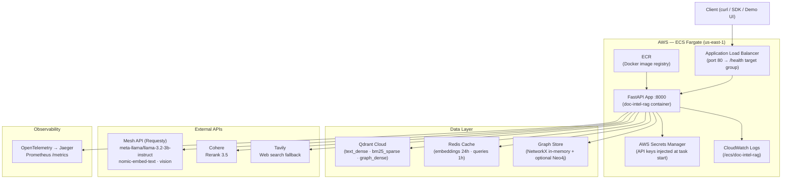
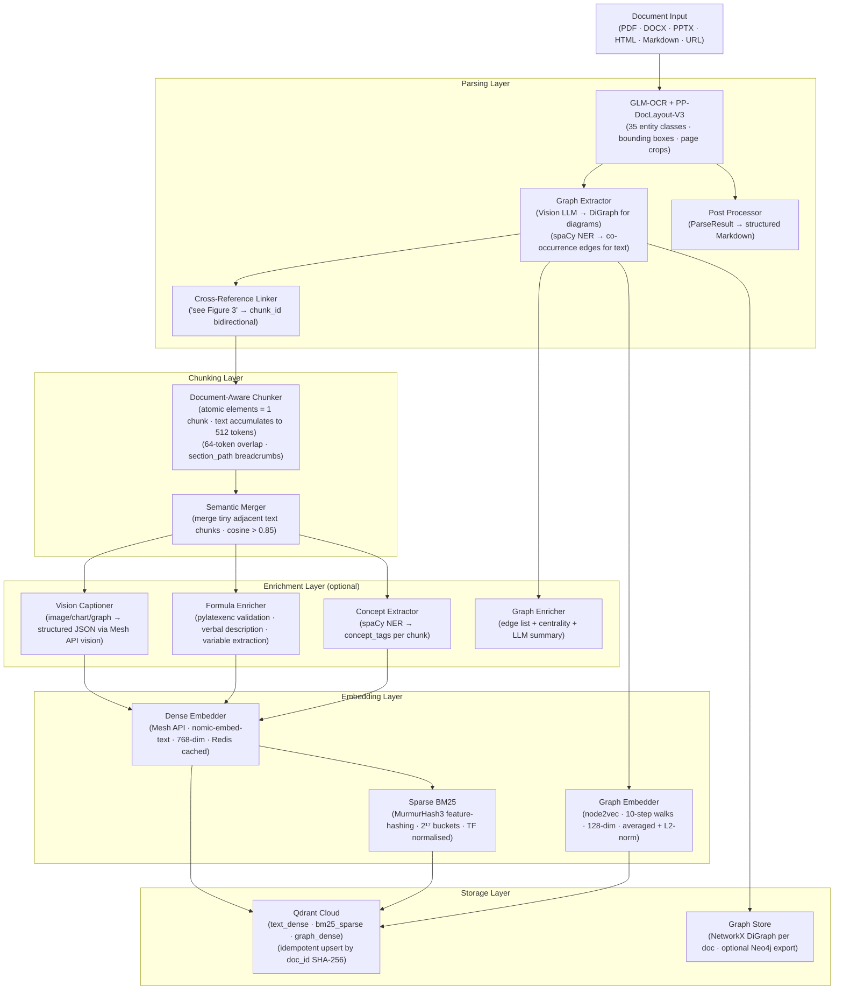
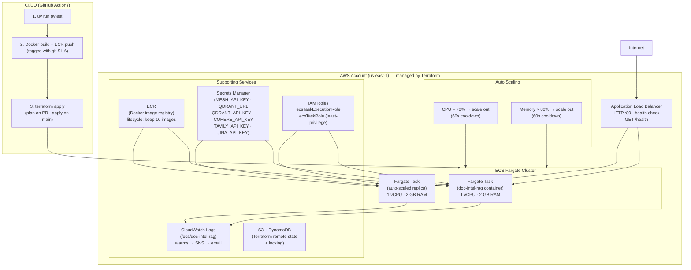

# doc-intel-rag — System Architecture

## Overview

doc-intel-rag is a production-grade multimodal Retrieval-Augmented Generation (RAG)
system. It ingests complex documents (PDF, DOCX, PPTX, HTML, Markdown), extracts and
indexes 35 distinct entity types per page, and answers natural language queries with
cited, grounded responses — including content from tables, formulas, charts, diagrams,
algorithms, and knowledge graphs.

---

## 1. High-Level System Architecture

---

## 2. Document Ingestion Pipeline

---

## 3. Query & Generation Pipeline

```mermaid
graph TB
    Query["User Query"]

    subgraph Safety_In ["Input Safety (pre-retrieval)"]
        PII["Stage 1 — PII Detection\n(Presidio · 10 entity types · redact or block)"]
        Injection["Stage 2 — Injection Detection\n(13 regex patterns + LLM classifier)"]
        Content["Stage 3 — Content Classification\n(regex harmful patterns → HTTP 400)"]
    end

    subgraph Routing ["Intent Routing"]
        Router["Semantic Router\n(LLM → JSON intent · 7 classes)\nfactual · analytical · visual · mathematical\ncode · relational · general"]
    end

    subgraph Retrieval ["Retrieval Layer"]
        HybridSearch["Hybrid Searcher\n(Dense query embed + BM25 sparse encode)\n(Qdrant Prefetch × 3 → RRF Fusion rank=60)"]
        GraphTraversal["Graph Traversal\n(2-hop BFS through NetworkX DiGraph)\n(triggered for relational / analytical intents)"]
        Reranker["Reranker\n(Cohere rerank-v3.5 · Jina · OpenAI cross-encoder)\n(re-scores top-N by true relevance)"]
        Ground["Groundedness Scorer\n(weighted cosine of reranked scores)\n(threshold 0.45)"]
        WebFB["Web Fallback\n(Tavily Search · up to 5 results)\n(appended as retrieval_source='web' chunks)"]
    end

    subgraph Generation ["Generation Layer"]
        CtxBuilder["Context Builder\n(text · table HTML · LaTeX formula · base64 image · graph edges · web URL)"]
        Prompt["Jinja2 Prompt Templates\n(system: cite every claim · user: query + context)"]
        Generator["LLM Generator\n(Mesh API · meta-llama/llama-3.2-3b-instruct · streaming SSE)\n(yields delta tokens → final sources + groundedness event)"]
        Citations["Citation Formatter\n([Source N] markers + bibliography block)"]
    end

    subgraph Safety_Out ["Output Safety (post-generation)"]
        NLI["Faithfulness — NLI Cross-Encoder\n(cross-encoder/nli-deberta-v3-base)\n(entailment score < 0.5 → disclaimer appended)"]
        Toxicity["Toxicity — Detoxify\n(6 dimensions · score > 0.7 → blocked response)"]
    end

    Response["SSE Stream / JSON Response → Client"]

    Query --> PII --> Injection --> Content --> Router
    Router --> HybridSearch
    HybridSearch --> GraphTraversal --> Reranker
    HybridSearch --> Reranker
    Reranker --> Ground
    Ground -->|"score ≥ 0.45"| CtxBuilder
    Ground -->|"score < 0.45"| WebFB --> CtxBuilder
    CtxBuilder --> Prompt --> Generator --> Citations --> NLI --> Toxicity --> Response
```

---

## 4. AWS Infrastructure

---

## 5. Data Models

### Chunk

| Field | Type | Description |
|---|---|---|
| `chunk_id` | UUID4 | Qdrant point ID |
| `doc_id` | SHA-256 | Source file hash — idempotency key |
| `modality` | enum | `text · image · table · formula · algorithm · graph · code` |
| `text` | str | Markdown / verbal content |
| `latex` | str? | Raw LaTeX for formula chunks |
| `html` | str? | HTML markup for table chunks |
| `raw_image_b64` | str? | Base64 PNG crop — NOT stored in Qdrant |
| `is_atomic` | bool | Never split (tables, formulas, figures) |
| `section_path` | list[str] | Breadcrumb from document root |
| `cross_refs` | list[str] | Linked chunk IDs from cross-reference linker |
| `graph_json` | dict? | Serialised NetworkX DiGraph |
| `concept_tags` | list[str] | spaCy NER named entities |
| `caption_json` | dict? | Structured enrichment payload from Mesh API |
| `enriched_text` | str | `text + caption_json` — used for dense embedding |

### Qdrant Named Vectors

| Vector | Dim | Distance | Purpose |
|---|---|---|---|
| `text_dense` | 768 | Cosine | Semantic similarity (nomic-embed-text) |
| `bm25_sparse` | 2¹⁷ | — | Keyword overlap (MurmurHash3 BM25) |
| `graph_dense` | 128 | Cosine | Graph structure similarity (node2vec) |

---

## 6. Security Design

| Layer | Control |
|---|---|
| Network | ALB SG: only port 80 inbound from internet. ECS SG: only port 8000 from ALB SG |
| Auth | `X-API-Key` header — configurable list, empty = dev mode (no auth) |
| Secrets | AWS Secrets Manager — injected at task startup, never in image or logs |
| Input | PII redaction (Presidio) + prompt injection (13 patterns + LLM) on every query |
| Output | NLI faithfulness (deberta-v3-base) + Detoxify toxicity on every response |
| Logs | All API keys masked in Loguru records via `_mask_secrets` filter |
| IAM | Least-privilege task roles; OIDC (`GitHubActionsDeployRole`) for CI — no static keys |

---

## 7. Technology Stack

| Layer | Technology |
|---|---|
| Language | Python 3.12, strict type hints throughout |
| API | FastAPI 0.115+ async, Server-Sent Events streaming |
| LLM + Embeddings | Mesh API / Requesty (`meta-llama/llama-3.2-3b-instruct` · `nomic-embed-text`) |
| Reranker | Cohere Rerank 3.5 (default) · Jina multimodal · OpenAI cross-encoder |
| Vector DB | Qdrant Cloud — 3 named vectors, Prefetch + RRF fusion |
| Graph DB | NetworkX (in-memory) + optional Neo4j Bolt export |
| Cache | Redis — embedding TTL 24h, query TTL 1h |
| Web Fallback | Tavily Search API |
| Safety | Microsoft Presidio (PII) · deberta-v3-base NLI · Detoxify |
| Container | Docker multi-stage CPU build + CUDA 12.4 GPU variant |
| Orchestration | AWS ECS Fargate + ALB — auto-scaling 1–5 tasks |
| IaC | Terraform 7 modules — S3 remote state + DynamoDB lock |
| CI/CD | GitHub Actions — test → build → ECR → terraform apply |
| Secrets | AWS Secrets Manager (6 secrets, `prevent_destroy = true`) |
| Logs | CloudWatch via `awslogs` driver + Loguru JSON structured logs |
| Traces | OpenTelemetry OTLP → Jaeger · Prometheus `/metrics` |
| Package manager | uv + `pyproject.toml` |
